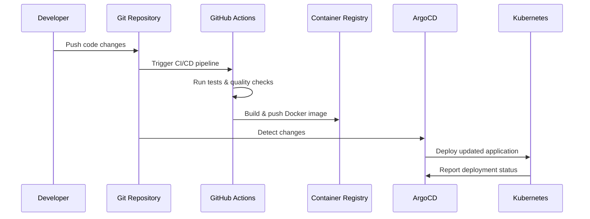

# Todo List Django - DevOps & Infrastructure as Code

> **A comprehensive DevOps learning project showcasing Infrastructure as Code (IaC) with Terraform, GitOps with ArgoCD,
and multi-cloud deployments**

## Project Overview

This repository serves as a hands-on learning platform for modern DevOps practices, focusing on Infrastructure as Code
and GitOps workflows. While the application itself is a Django-based Todo List with Celery for background tasks, the
primary focus is demonstrating enterprise-grade DevOps tooling and practices.

### Why This Project?

- **Django Foundation**: Leverages Django's mature ecosystem with advanced features like Celery for background
  processing
- **Real-world Complexity**: Includes database migrations, background tasks, and production-ready configurations
- **DevOps Focus**: Showcases Terraform, ArgoCD, Kubernetes, and multi-cloud deployments
- **Learning Platform**: Perfect for understanding modern infrastructure patterns and GitOps workflows

## 🛠️ Technology Stack

### Application Layer

- **Framework**: Django 5.0+ with Python 3.12
- **Background Tasks**: Celery with Redis/Valkey
- **Database**: PostgreSQL
- **Containerization**: Docker

### Infrastructure & DevOps

- **Infrastructure as Code**: Terraform with modular architecture
- **Container Orchestration**: Kubernetes
- **GitOps**: ArgoCD for continuous deployment
- **CI/CD**: GitHub Actions with comprehensive testing
- **Cloud Providers**: DigitalOcean (implemented), AWS (implemented), GCP/Azure (planned)

## 📁 Project Structure

```
├── terraform/                    # Infrastructure as Code
│   ├── digital_ocean/           # DigitalOcean implementation
│   │   ├── modules/             # Reusable Terraform modules
│   │   │   ├── kubernetes/      # K8s cluster management
│   │   │   ├── pg_database/     # PostgreSQL database
│   │   │   ├── val_key/         # Redis/Valkey cache
│   │   │   ├── container_registry/ # Container registry
│   │   │   └── app_platform/    # App Platform (alternative)
│   │   └── envs/                # Environment-specific configs
│   │       ├── prod/            # Production environment
│   │       └── stage/           # Staging environment
│   └── aws/                     # AWS implementation
│       ├── modules/             # Reusable Terraform modules
│       │   ├── network/         # VPC, subnets, NAT gateways
│       │   ├── eks/             # EKS cluster and node groups
│       │   ├── rds_postgres/    # RDS PostgreSQL database
│       │   ├── elasticache_valkey/ # ElastiCache Redis/Valkey
│       │   └── ecr/             # Elastic Container Registry
│       └── main/                # Multi-stage deployment
│           ├── 0-infra/         # Infrastructure provisioning
│           ├── 1-k8s_tooling/   # K8s tools (ArgoCD, Ingress)
│           └── 2-argocd_app/    # ArgoCD application config
├── k8s/                         # Kubernetes manifests
│   ├── deployment.yaml          # Application deployment
│   ├── service.yaml             # Service definitions
│   ├── ingress.yaml             # Ingress configuration
│   ├── configmap.yaml           # Configuration management
│   ├── secret.yaml              # Secret management
│   └── hpa.yaml                 # Horizontal Pod Autoscaler
├── .github/workflows/           # CI/CD pipelines
├── Dockerfile                   # Container definition
└── Todo_List_App/              # Django application
```

## 🌐 Multi-Cloud Strategy

### Current Implementations

#### DigitalOcean ✅ **Fully Implemented**

- Kubernetes cluster with auto-scaling
- Managed PostgreSQL database
- Managed Redis/Valkey cache
- Container registry integration
- ArgoCD for GitOps
- NGINX Ingress Controller
- Load balancer configuration

#### AWS ✅ **Fully Implemented**

- **EKS** (Elastic Kubernetes Service) with managed node groups
- **RDS** for PostgreSQL with multi-AZ support
- **ElastiCache** for Redis/Valkey with user authentication
- **ECR** (Elastic Container Registry) with vulnerability scanning
- **VPC** with public/private subnets and NAT gateways
- **ArgoCD** for GitOps deployment
- **NGINX Ingress Controller** with AWS Load Balancer
- **AWS Secrets Manager** for credential management

### Planned Implementations

#### Google Cloud Platform

- **GKE** (Google Kubernetes Engine)
- **Cloud SQL** for PostgreSQL
- **Memorystore** for Redis
- **GCR** (Google Container Registry)
- **Cloud Load Balancing**

#### Microsoft Azure

- **AKS** (Azure Kubernetes Service)
- **Azure Database for PostgreSQL**
- **Azure Cache for Redis**
- **ACR** (Azure Container Registry)
- **Azure Load Balancer**

## 🔄 GitOps Workflow

### ArgoCD Configuration

The project implements a complete GitOps workflow using ArgoCD:

1. **Repository Monitoring**: ArgoCD monitors the Git repository for changes
2. **Automatic Sync**: Changes are automatically deployed to Kubernetes
3. **Self-Healing**: ArgoCD reverts manual changes to maintain desired state
4. **Pruning**: Resources not in Git are automatically removed

### Deployment Flow



## 🧪 CI/CD Pipeline

### GitHub Actions Workflow

The CI/CD pipeline includes:

- **Code Quality**: Pre-commit hooks, linting, formatting
- **Testing**: Unit tests, integration tests, Django checks
- **Security**: Dependency vulnerability scanning
- **Infrastructure**: Terraform plan/apply for infrastructure changes
- **Container**: Docker build, scan, and push
- **Deployment**: Automated deployment via ArgoCD

### Pipeline Stages

1. **Test Stage**
    - Python dependency installation
    - Code quality checks (pre-commit)
    - Database migration validation
    - Unit and integration tests
    - Security vulnerability scanning

2. **Build Stage**
    - Docker image building
    - Container vulnerability scanning
    - Push to container registry

3. **Deploy Stage**
    - Infrastructure provisioning (Terraform)
    - Application deployment (ArgoCD)

## 📊 Monitoring & Observability

### Kubernetes Monitoring

- **Health Checks**: Liveness and readiness probes
- **Resource Management**: CPU and memory limits/requests
- **Auto-scaling**: Horizontal Pod Autoscaler (HPA)
- **Logging**: Centralized logging with structured logs

### Application Monitoring

- **Django Health Endpoints**: `/health/` endpoint for monitoring
- **Celery Monitoring**: Task queue monitoring and metrics
- **Database Monitoring**: Connection pooling and query performance

## 🚀 Deployment Environments

### Staging (DigitalOcean App Platform)

- **Purpose**: Pre-production testing and validation
- **Platform**: DigitalOcean App Platform
- **Topology**:
    - Web service running the Django container (`todo:latest`)
    - Two background components: Celery Worker and Celery Beat
- **Provisioning**: Terraform under `terraform/digital_ocean/envs/stage/` using the `app_platform` module
- **Image Source**: DigitalOcean Container Registry (DOCR); CI builds and pushes `latest` on `develop`
- **Config/Secrets**: Passed via Terraform variables (`TF_VAR_*`) sourced from GitHub Secrets/Vars
- **Deployment Trigger**: Push to `develop` → build & push image → App Platform auto-deploys or is updated via Terraform
  apply

### Production (DigitalOcean Kubernetes + ArgoCD)

- **Purpose**: Live environment
- **Platform**: DigitalOcean Kubernetes (DOKS) with NGINX Ingress
- **Topology**:
    - Deployments: `todo-list-web`, `todo-list-celery-worker`, `todo-list-celery-beat`
    - `Service`, `Ingress`, and `HPA` defined in `k8s/`
- **Provisioning**: Terraform under `terraform/digital_ocean/envs/prod/` (cluster, DB, Valkey, Ingress-NGINX, ArgoCD)
- **App CD**: ArgoCD `Application` defined in `terraform/digital_ocean/envs/prod/argocd_app/main.tf` pointing to `k8s/`
  with automated sync/self-heal/prune
- **Image Source**: DOCR; CI pushes `stable` on `main`, ArgoCD picks up repo changes and reconciles
- **Config/Secrets**: `kubernetes_secret` and `kubernetes_config_map` created by Terraform (DB/Redis/Django/env
  settings)

### Production (AWS EKS + ArgoCD)

- **Purpose**: Live environment on AWS
- **Platform**: AWS EKS with NGINX Ingress Controller
- **Topology**:
    - Deployments: `todo-list-web`, `todo-list-celery-worker`, `todo-list-celery-beat`
    - `Service`, `Ingress`, and `HPA` defined in `k8s/`
- **Provisioning**: Multi-stage Terraform under `terraform/aws/main/`:
    - `0-infra/`: VPC, EKS, RDS, ElastiCache, ECR
    - `1-k8s_tooling/`: NGINX Ingress, ArgoCD, Kubernetes secrets/configmaps
    - `2-argocd_app/`: ArgoCD Application configuration
- **App CD**: ArgoCD `Application` defined in `terraform/aws/main/2-argocd_app/main.tf` pointing to `k8s/`
  with automated sync/self-heal/prune
- **Image Source**: ECR; CI pushes `stable` on `main`, ArgoCD picks up repo changes and reconciles
- **Config/Secrets**: AWS Secrets Manager integration with Kubernetes secrets created by Terraform
- **Infrastructure Features**:
    - Multi-AZ RDS PostgreSQL with automated backups
    - ElastiCache Redis with user authentication
    - ECR with vulnerability scanning
    - VPC with public/private subnets and NAT gateways
    - AWS Load Balancer via NGINX Ingress Controller

## 📄 License

This project is licensed under the MIT License - see the [LICENSE.txt](LICENSE.txt) file for details.

---

**Happy Learning! 🎓**

*This project is designed for educational purposes and demonstrates modern DevOps practices. Feel free to fork, modify,
and learn from the implementations.*

